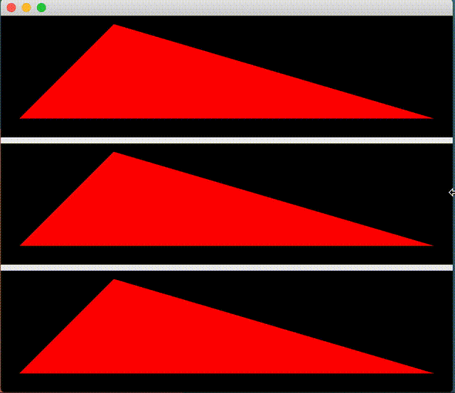

# Metal Test Project

The goal of this project is to figure out a way to get smooth window resizing to work properly in Metal. `MTKView` has a problem where the redrawing is not synchronized with the window resize so it draws stretched frames.

This project draws views with a triangle with two vertices at fixed offsets from the left edge, and one vertex at a fixed offset from the right edge. It has three implementations that are displayed stacked vertically in the following order:

1. `MTKView`. Which is supposed to be the easy view. Apple's Hello Triangle example uses this, and suffers terrible resize juddering.
2. `NSView`. This is a benchmark implementation that draws the triangle with Core Graphics, it works perfectly.
3. `CAMetalLayer`. Implemented according to the top answer from [this Stack Overflow question](https://stackoverflow.com/questions/45375548/resizing-mtkview-scales-old-content-before-redraw). Using just the Stack Overflow answer works better than `MTKView` but still glitches occasionally. It's also necessary to use `presentsWithTransaction` and follow the recommendations in the docs for that option regarding `waitUntilScheduled`, that delivers completely glitch-free results.

# GIF

Triangles are stacked in the order listed above, watch the top vertex of the top triangle:

